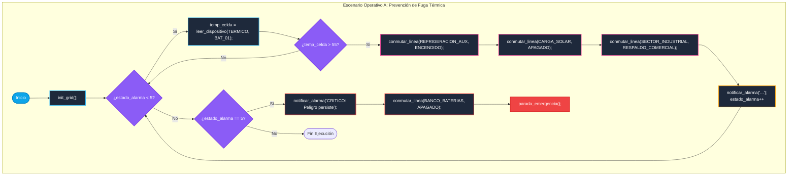

# Escenario Operativo A: Prevención de Fuga Térmica y Gestión de Alivio de Carga 

``El programa debe monitorizar de forma continua e iterativa la temperatura de un banco de baterías específico empleando estructuras repetitivas. Si la temperatura registrada supera un umbral crítico de seguridad (por ejemplo, 55 grados Celsius), el programa debe activar de forma inmediata los sistemas de refrigeración auxiliar, desconectar las líneas de carga solar para detener el ingreso de energía térmica y desviar el consumo del sector industrial hacia la red comercial de respaldo para aliviar el estrés del componente. El ciclo debe terminar o emitir alertas de emergencia recurrentes si el peligro persiste tras un período determinado.``

### Diagrama de flujo


#### Bloque de código
```
init_grid;

while estado_alarma < 5 do
    temp_celda = leer_dispositivo(TERMICO, BAT_01);
    
    if temp_celda > 55 then
        conmutar_linea(REFRIGERACION_AUX, ENCENDIDO);
        conmutar_linea(CARGA_SOLAR, APAGADO);
        conmutar_linea(SECTOR_INDUSTRIAL, RESPALDO_COMERCIAL);
        
        notificar_alarma("Advertencia: Posible fuga termica en BAT_01. Mitigacion activada.");
    end_if;
end_while;

if estado_alarma == 5 then
    notificar_alarma("CRITICO: El peligro persiste tras multiples intentos. Abortando.");
    conmutar_linea(BANCO_BATERIAS, APAGADO);
    parada_emergencia();
end_if;
```


#### Explicación paso a paso

| Paso n | Código                                                                                                                                                                      | Descripción                                  | Lógica                                                                                                                                                                                                                                                                                                                                                                                                                                                                                                |
| :----: | --------------------------------------------------------------------------------------------------------------------------------------------------------------------------- | -------------------------------------------- | ----------------------------------------------------------------------------------------------------------------------------------------------------------------------------------------------------------------------------------------------------------------------------------------------------------------------------------------------------------------------------------------------------------------------------------------------------------------------------------------------------- |
|   1    | `init_grid;`                                                                                                                                                                | Inicialización del sistema                   | Este script ejecuta la directiva de arranque. Indicando al intérprete que abra los canales de comunicación con los drivers de los relés y los sensores térmicos de la planta.                                                                                                                                                                                                                                                                                                                         |
|   2    | `while estado_alarma < 5 do ... end_while;`                                                                                                                                 | Bucle de monitoreo                           | Utilizamos la variable global reservada `estado_alarma`. Mientras el sistema tenga menos de 5 alarmas acumuladas, el ciclo seguirá evaluando la planta                                                                                                                                                                                                                                                                                                                                                |
|   3    | `temp_celda = leer_dispositivo(TERMICO, BAT_01);`                                                                                                                           | Lectura del componente físico                | En cada iteración del bucle, se invoca la función de lectura general. Se le pasa el tipo de sensor (`TERMICO`) y el identificador de la constante física (`BAT_01`). El valor numérico retornado se asigna a la variable local `temp_celda`.                                                                                                                                                                                                                                                          |
|   4    | `if temp_celda > 55 then ... end_if;`                                                                                                                                       | Evaluación léxica del umbral crítico         | Si la variable `temp_celda` supera el literal numérico `55`, el flujo de control entra al bloque de mitigación. Si es menor o igual, el bloque se ignora y el bucle vuelve a empezar silenciosamente.                                                                                                                                                                                                                                                                                                 |
|   5    | 1. `conmutar_linea(REFRIGERACION_AUX, ENCENDIDO);`<br><br>2. `conmutar_linea(CARGA_SOLAR, APAGADO);`<br><br>3. `conmutar_linea(SECTOR_INDUSTRIAL, RESPALDO_COMERCIAL);`<br> | Activación de mitigación (Actuadores)        | Si la temperatura es superior a 55 grados, el intérprete ejecuta las tres acciones de contingencia obligatorias de manera secuencial:<br><br>1. Activa los sistemas de refrigeración auxiliar.<br>        <br>2. Desconecta físicamente las líneas de entrada de los paneles para detener el ingreso térmico.<br>        <br>3. Usa el conmutador de transferencia para desviar el consumo de los sectores industriales hacia la red eléctrica comercial, aliviando el estrés sobre las baterías.<br> |
|   6    | `notificar_alarma("...");`                                                                                                                                                  | Acumulación de persistencia                  | Por cada ciclo en el que la temperatura siga sin bajar de 55°C, se emite una alerta recurrente a la consola del operador. Esta función suma automáticamente `+1` a la variable `estado_alarma`.                                                                                                                                                                                                                                                                                                       |
|   7    | `if estado_alarma == 5 then ... parada_emergencia(); end_if;`                                                                                                               | Parada de emergencia por peligro persistente | Si la refrigeración no hizo efecto y el bucle repitió la advertencia 5 veces el bucle se rompen, el sistema lanza un mensaje crítico final, aísla físicamente todo el banco de baterías por seguridad (usando `APAGADO`) y ejecuta la palabra reservada `parada_emergencia();`, la cual detiene la ejecución del intérprete de forma definitiva.                                                                                                                                                      |