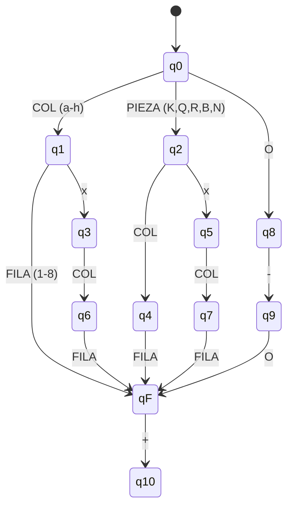

# Definiciones de un PGN

### ¿Qué es PGN y qué se va a reconocer?

PGN significa **Portable Game Notation** y es una notación usada para escribir partidas de ajedrez de forma textual. Al ser muy amplio aquí sólo se representa un subconjunto de reconocible por autómatas finitos, el propósito no es validar la legalidad completa de una partida, sino reconocer patrones léxicos compatibles con un subconjunto de PGN.

### Definir el subconjunto simplificado del PGN

Notación PGN simplificada:

| Componente          | Descripción                                    | Ejemplo                    |
| ------------------- | ---------------------------------------------- | -------------------------- |
| **Pieza**           | K, Q, R, B, N. Si no hay pieza, se asume peón. | `N`, `Q`, (peón implícito) |
| **Columna origen**  | a–h.                                           | `e`, `b`                   |
| **Fila origen**     | 1–8.                                           | `4`, `7`                   |
| **Captura**         | `x`. Indica que se toma una pieza.             | `x`                        |
| **Columna destino** | a–h (obligatoria).                             | `d`, `f`                   |
| **Fila destino**    | 1–8 (obligatoria).                             | `5`, `3`                   |
| **Jaque**           | `+`. Señala jaque al rey.                      | `+`                        |
| **Enroques**        | `O-O` (corto) u `O-O-O` (largo).               | `O-O`, `O-O-O`             |

Para simplificar el problema, se definió un subconjunto del lenguaje PGN compuesto por movimientos básicos de peones, piezas, capturas y enroque corto. Esta decisión permite construir una expresión regular y un autómata finito determinístico capaces de reconocer cadenas textuales sin necesidad de analizar la legalidad completa de la partida.

Se definen los siguientes movimientos: **movimientos básicos, capturas, enroque simple y jaque.**

| **Tipo de movimiento** | **Sintaxis elegida**                        | **Ejemplos**             |
| ---------------------- | ------------------------------------------- | ------------------------ |
| Peón simple            | `[a-h][1-8]`                                | e4, d5, a3               |
| Peón con captura       | `[a-h]x[a-h][1-8]`                          | exd5, cxb2               |
| Caballo simple         | `N[a-h][1-8]`                               | Nf3, Nc6, Ne5            |
| Caballo con captura    | `Nx[a-h][1-8]`                              | Nxe5, Nxf2               |
| Alfil simple           | `B[a-h][1-8]`                               | Bc4, Bb5, Be2            |
| Alfil con captura      | `Bx[a-h][1-8]`                              | Bxc4, Bxh7               |
| Torre simple           | `R[a-h][1-8]`                               | Re1, Ra8, Rd3            |
| Torre con captura      | `Rx[a-h][1-8]`                              | Rxe5, Rxa7               |
| Dama simple            | `Q[a-h][1-8]`                               | Qh5, Qd2, Qa4            |
| Dama con captura       | `Qx[a-h][1-8]`                              | Qxe5, Qxh7               |
| Rey simple             | `K[a-h][1-8]`                               | Ke2, Kg1, Kf7            |
| Rey con captura        | `Kx[a-h][1-8]`                              | Kxe2, Kxf3               |
| Enroque corto          | `O-O`                                       | O-O                      |
| Jaque                  | `+` al final de cualquier movimiento válido | Qh5+, Nxf7+, Bc4+, exd5+ |

#### Definición formal

> Sea _L_ el lenguaje formado por movimientos básicos de ajedrez escritos en notación PGN simplificada. El lenguaje aceptará cadenas que representen movimientos simples de peones, movimientos simples de piezas, capturas, jaques y enroque corto.
> ejemplo representativo:

## _L = { e4, a3, Nf3, Bb5, Qxe5, Bxc4, O-O, ... }_

# Definición formal de la gramática

Sea la gramática:

```text
G = (V, Σ, P, S)
```

### Símbolos no terminales (V)

| Símbolo | Descripción            |
| ------- | ---------------------- |
| S       | símbolo inicial        |
| MOV     | movimiento             |
| PEON    | movimiento de peón     |
| PIEZA   | movimiento de pieza    |
| ENROQUE | enroque corto          |
| JAQUE   | jaque                  |
| PIEZAID | identificador de pieza |
| COL     | columna a–h            |
| FILA    | fila 1–8               |

### Símbolos terminales (Σ)

| Terminal | Valores                |
| -------- | ---------------------- |
| PIEZAID  | K, Q, R, B, N          |
| COL      | a, b, c, d, e, f, g, h |
| FILA     | 1, 2, 3, 4, 5, 6, 7, 8 |
| Otros    | x, +, O, -             |

### Producciones (P)

| Regla   | Alternativas                        |
| ------- | ----------------------------------- |
| S       | MOV<br>MOV JAQUE                    |
| MOV     | PEON<br>PIEZA <br>ENROQUE           |
| PEON    | COL, FIL, COL x FILA                |
| PIEZA   | PIEZAID COL FILA PIEZAID x COL FILA |
| PIEZAID | K Q R B N                           |
| ENROQUE | O-O                                 |
| JAQUE   | +                                   |
| COL     | a\|b\|c\|d\|e\|f\|g\|h              |
| FILA    | 1\|2\|3\|4\|5\|6\|7\|8              |

### Ejemplos de derivaciones

| Tipo                | Ejemplos    |
| ------------------- | ----------- |
| Peón simple         | e4, a3      |
| Captura de peón     | exd5, cxb2  |
| Movimiento de pieza | Nf3, Bb5    |
| Captura de pieza    | Qxe5, Bxc4  |
| Enroque             | O-O         |
| Jaque               | Qh5+, Nxf7+ |

# Diseño de la Expresión Regular

## Expresión regular completa

```regex
(
[a-h][1-8]
|
[a-h]x[a-h][1-8]
|
[KQRBN][a-h][1-8]
|
[KQRBN]x[a-h][1-8]
|
O-O
)
\+?
```

## Versión compacta

```regex
([a-h][1-8]|[a-h]x[a-h][1-8]|[KQRBN][a-h][1-8]|[KQRBN]x[a-h][1-8]|O-O)\+?
```

## Tabla de simbolos

| Subtítulo         | Descripción                                     | Símbolos / regex     | Ejemplos                     |
| ----------------- | ----------------------------------------------- | -------------------- | ---------------------------- |
| Columna           | Columna origen o destino                        | `[a-h]`              | -                            |
| Fila              | Fila origen o destino                           | `[1-8]`              | -                            |
| Piezas            | Identificador de pieza                          | `[KQRBN]`            | -                            |
| Peón simple       | Movimiento básico de peón                       | `[a-h][1-8]`         | e4, d5, a3                   |
| Peón con captura  | Captura de peón                                 | `[a-h]x[a-h][1-8]`   | exd5, cxb2                   |
| Pieza simple      | Movimiento básico de pieza                      | `[KQRBN][a-h][1-8]`  | Nf3, Bc4, Re1, Qh5, Ke2      |
| Pieza con captura | Captura de pieza                                | `[KQRBN]x[a-h][1-8]` | Nxe5, Bxh7, Rxa7, Qxe5, Kxf3 |
| Enroque corto     | Enroque corto válido                            | `O-O`                | O-O                          |
| Jaque             | Jaque opcional al final de un movimiento válido | `\+`                 | Qh5+, Nxf7+                  |

# Definición formal del AFD

Sea:

```text
M = (Q, Σ, δ, q0, F)
```

Donde:

### Estados

```text
Q = {
q0, q1, q2, q3, q4, q5, q6, q7,
q8, q9, q10, q11,
qF,
qDead
}
```

### Estado inicial

```text
q0
```

### Estados de aceptación

```text
F = { qF }
```

---

## Clases de símbolos

| **Símbolo** | **Significado** |
| ----------- | --------------- |
| COL         | a,b,c,d,e,f,g,h |
| FILA        | 1,2,3,4,5,6,7,8 |
| PIEZA       | K,Q,R,B,N       |
| x           | captura         |
| +           | jaque           |
| O           | enroque         |
| -           | guion           |

---

## Representacion


