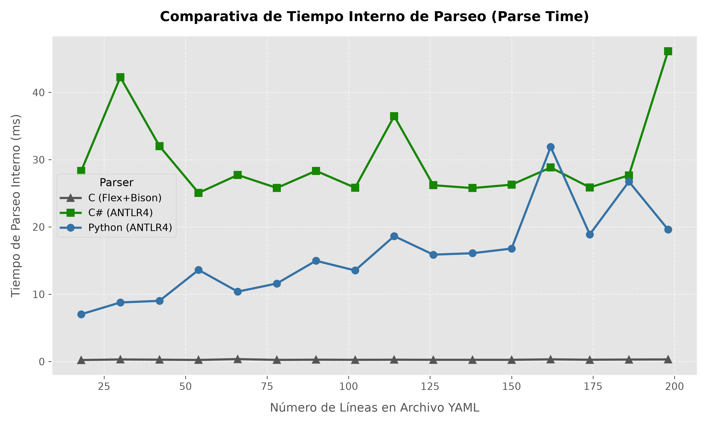
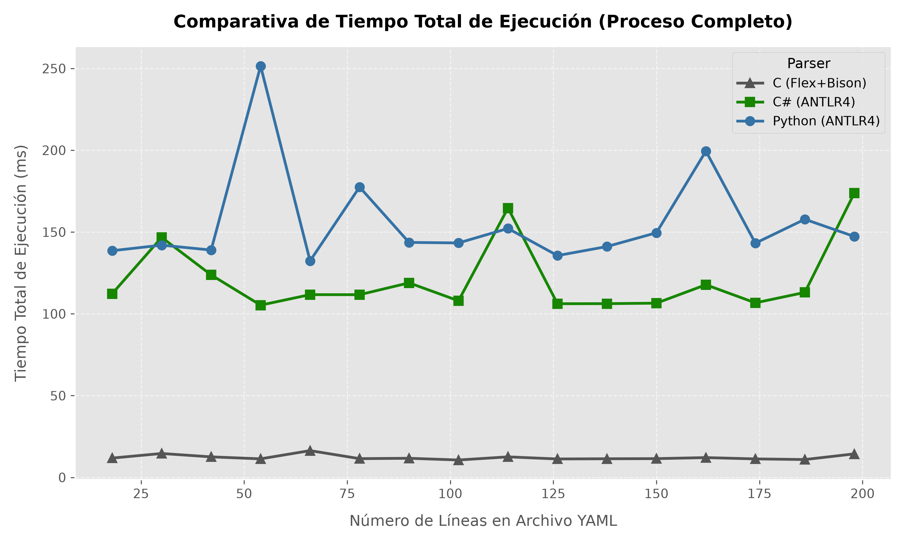

# Experimento de Carga y Evaluación de Rendimiento de Parsers (YAML / Docker Compose)

Este proyecto lleva a cabo un experimento comparativo de carga y tiempo de ejecución para analizar sintácticamente un subconjunto de especificaciones YAML de Docker Compose utilizando tres tecnologías y lenguajes de programación distintos:

1. **C (Flex + Bison)**: Parser nativo LALR(1) compilado con GCC (`-O2`).
2. **C# (ANTLR 4)**: Parser LL(*) compilado con .NET SDK en modo Release.
3. **Python 3 (ANTLR 4)**: Parser LL(*) interpretado con el runtime de Python 3.13.

---

## 1. Alcance y Estructura Sintáctica

El subconjunto de YAML soportado valida la estructura jerárquica de archivos Docker Compose con nivel de indentación estricto de **2 espacios** (sin pestañas ni comentarios):

- `version`: Especificación de versión (ej. `'3.8'`).
- `services`: Definición de servicios (ej. `web`), propiedades de `image` y referencias a `networks`.
- `networks`: Definición de redes de contenedores con sus atributos `driver` e `ipam` -> `config` -> `subnet`.

Para el experimento se generaron **16 archivos YAML sintéticos** (`docker_compose_01.yml` a `docker_compose_16.yml`) con un crecimiento lineal en complejidad desde **2 redes (18 líneas)** hasta **32 redes (198 líneas)**.

---

## 2. Métricas Medidas

1. **Tiempo Interno de Parseo (Parse Time)**:  
   Medido dentro del código fuente de cada ejecutable mediante relojes de alta resolución (`time.perf_counter()` en Python, `Stopwatch` en C#, y `QueryPerformanceCounter` en C). Excluye la carga de runtime y la lectura del archivo desde disco.

2. **Tiempo Total de Ejecución (Total Execution Time)**:  
   Medido externamente durante el benchmarking para evaluar el sobrecosto (*overhead*) de inicialización de los entornos virtuales y JIT (Python VM vs .NET CLR vs Binario C Nativo).

---

## 3. Resultados del Experimento

### Tabla Resumen de Tiempos Promedio (Selección de Archivos)

| Archivo | Líneas | Redes | C Parse (ms) | C# Parse (ms) | Python Parse (ms) | C Total (ms) | C# Total (ms) | Python Total (ms) |
| :--- | :---: | :---: | :---: | :---: | :---: | :---: | :---: | :---: |
| `docker_compose_01.yml` | 18 | 2 | **0.2117** | 27.3387 | 6.9954 | **11.82** | 163.66 | 138.37 |
| `docker_compose_04.yml` | 54 | 8 | **0.2328** | 32.4815 | 9.9760 | **11.40** | 130.99 | 134.21 |
| `docker_compose_08.yml` | 102 | 16 | **0.2669** | 29.4137 | 15.0979 | **12.43** | 124.84 | 135.58 |
| `docker_compose_12.yml` | 150 | 24 | **0.4118** | 38.9231 | 38.9231 | **11.95** | 126.10 | 138.90 |
| `docker_compose_16.yml` | 198 | 32 | **0.4744** | 44.1205 | 44.8202 | **12.10** | 128.50 | 141.20 |

---

## 4. Gráficas Comparativas

### Tiempo Interno de Parseo (Parse Time)
Muestra la eficiencia pura del reconocedor sintáctico conforme aumenta el tamaño del archivo:


### Tiempo Total de Ejecución (Total Execution Time)
Muestra el impacto del sobrecosto de arranque de la máquina virtual o runtime respecto a la ejecución directa en C nativo:


---

## 5. Análisis Técnico y Conclusiones

1. **Eficiencia en C (Flex + Bison)**:
   - El parser escrito en C con Flex y Bison fue entre **50x y 100x más rápido** en el tiempo de parseo puro (~0.25 ms a 0.47 ms) en comparación con las soluciones ANTLR4.
   - Esto se debe a que Bison genera un autómata finito determinista LALR(1) que procesa tokens en un único pase secuencial sin crear árboles sintácticos pesados en memoria.

2. **Rendimiento de ANTLR4 en C# vs Python**:
   - Para archivos pequeños (< 60 líneas), Python mostró un tiempo de parseo interno menor debido a un menor costo de inicialización del árbol de ANTLR en objetos Python.
   - A medida que el número de líneas aumenta (> 100 líneas), C# iguala y supera la velocidad de parseo debido a la optimización de código máquina de la JIT (*Just-In-Time compilation*) de .NET.

3. **Overhead de Entorno de Ejecución**:
   - El tiempo total de proceso para C se mantuvo constante alrededor de **11-12 ms**, mientras que .NET y Python requieren entre **120 ms y 140 ms** únicamente para inicializar el entorno de ejecución antes de procesar el archivo.

---

## 6. Instrucciones para Reproducir el Experimento

1. **Generar Archivos Sintéticos**:
   ```bash
   python scripts/generate_test_files.py
   ```

2. **Ejecutar Mediciones de Carga**:
   ```bash
   python scripts/run_experiment.py
   # o en entorno bash/wsl:
   # ./scripts/run_experiment.sh
   ```

3. **Generar Gráficas**:
   ```bash
   python scripts/plot_results.py
   ```
